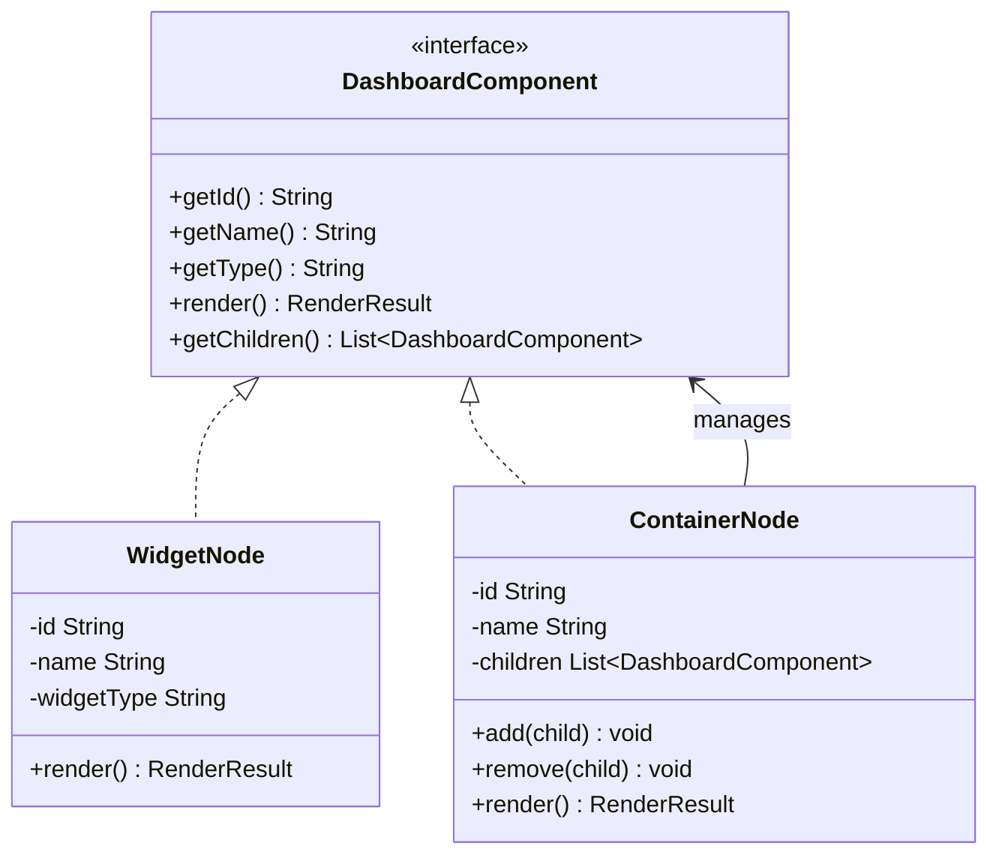
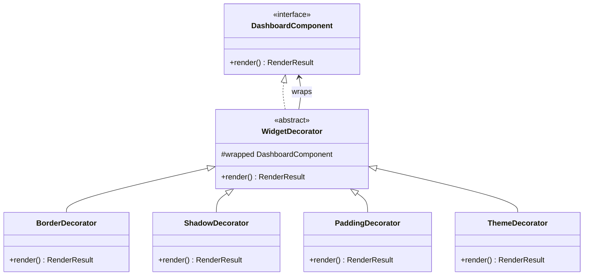
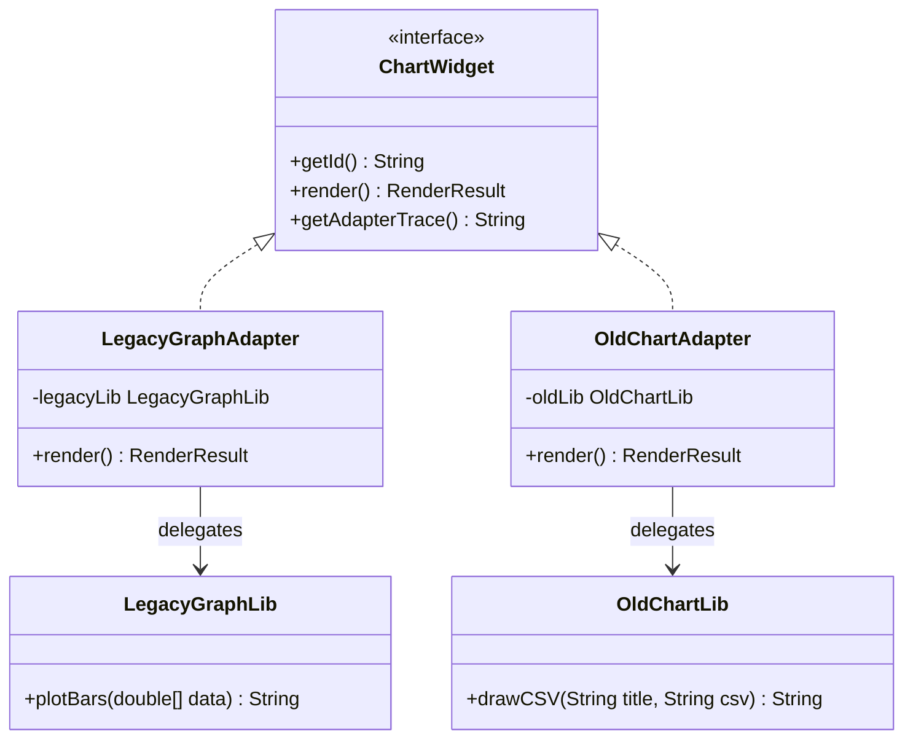
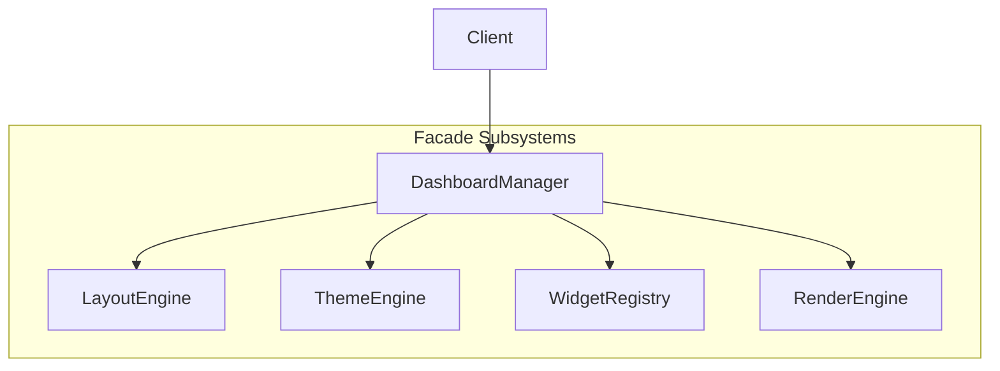
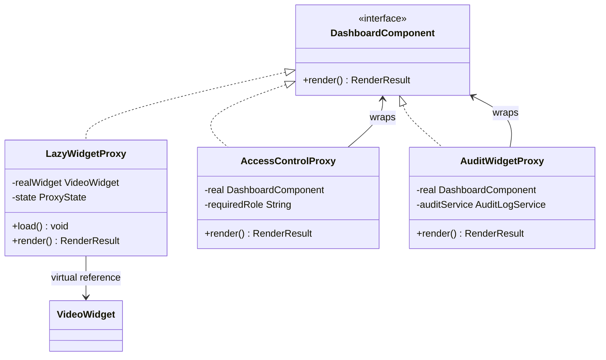
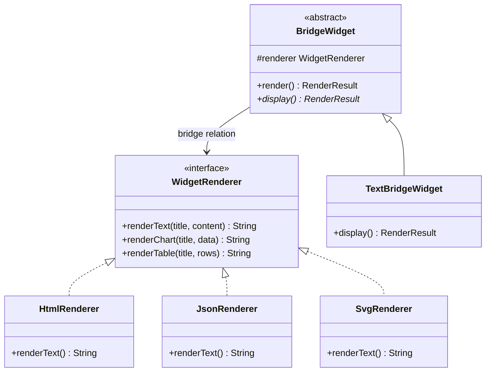
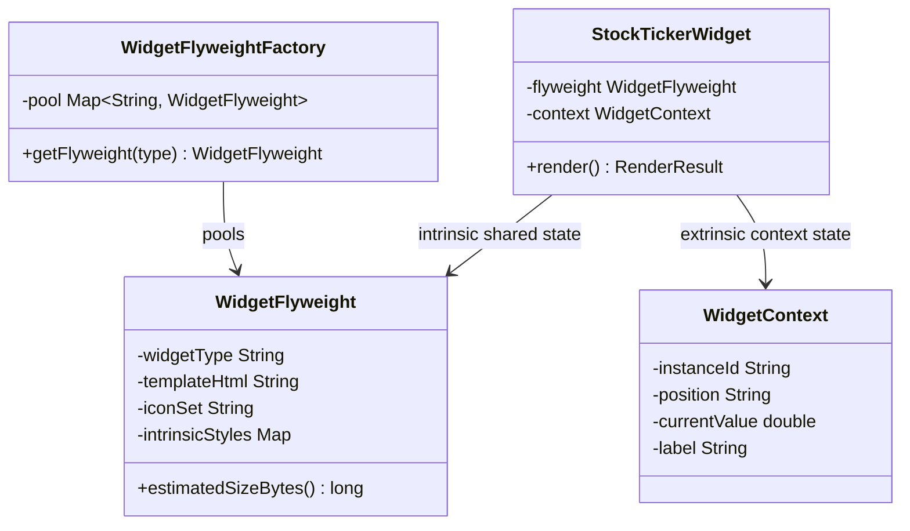

# PatternForge — Structural Design Patterns Playground

PatternForge is an interactive, full-stack Java Spring Boot application simulating and visualizing seven core Structural Design Patterns: **Composite, Decorator, Adapter, Facade, Proxy, Bridge, and Flyweight**.

---

## 1. Architecture Overview
The application follows a clean package-by-responsibility structure under the base package `com.patternforge`:

```
com.patternforge
├── config/          # WebSocket configuration, OpenAPI/Swagger settings
├── controller/      # REST API Controllers (one per design pattern) and UI View mapping
├── domain/          # Immutable records (RenderResult, CallChainEvent) and core models
├── inspector/       # AOP Aspect (PatternInspectorAspect) and PatternStackTracer
├── pattern/         # Concrete pattern implementations
│   ├── composite/   # WidgetNode, ContainerNode, Exceptions
│   ├── decorator/   # WidgetDecorator and concrete styling wraps
│   ├── adapter/     # Adapters for LegacyGraphLib and OldChartLib
│   ├── facade/      # Subsystem engines (Layout, Theme, Registry, Render)
│   ├── proxy/       # Lazy, Access Control, and Smart Auditing proxies
│   ├── bridge/      # Abstraction widgets and concrete visual Renderers
│   └── flyweight/   # Shared intrinsic state template flyweight structures
└── service/         # Business logic services
```

---

## 2. Design Pattern Architecture Diagrams

### Composite Pattern
Manages hierarchical containers and leaves uniformly:


### Decorator Pattern
Dynamically wraps styling behavior:


### Adapter Pattern
Adapts legacy graph rendering libraries to standard widgets:


### Facade Pattern
Exposes a simplified coordinator interface to client components:


### Proxy Pattern
Intercepts requests to control lazy-loading, security access, and auditing:


### Bridge Pattern
Separates logical abstractions from rendering implementations:


### Flyweight Pattern
Shares identical intrinsic states among multiple extrinsic contexts:


---

## 3. How to Run
### Prerequisites
- Java 17+ installed.
- Maven installed.
- Docker installed (optional, for container deployment).

### Local Execution (Maven)
Execute the following Maven command from the `pattern_forge` root directory:
```bash
mvn spring-boot:run
```
The server starts locally at `http://localhost:8080`.

### Containerized Execution (Docker Compose)
Execute the following command to build and run the application container:
```bash
docker compose up --build -d
```

### Navigation URLs
- **Main Playground UI:** [http://localhost:8080/](http://localhost:8080/)
- **Swagger Documentation:** [http://localhost:8080/swagger-ui.html](http://localhost:8080/swagger-ui.html)
- **OpenAPI JSON Spec:** [http://localhost:8080/v3/api-docs](http://localhost:8080/v3/api-docs)

---

## 4. Pattern Implementations & Design Decisions

### Composite
Combines individual `WidgetNode` leaves and nested `ContainerNode` composites into a uniform `DashboardComponent` hierarchy. 
* **Design Decision**: Recursive validation checks have been implemented inside `ContainerNode.add()` to scan the entire descendant sub-tree, immediately throwing a `CircularReferenceException` if a loop is detected, preventing cyclic loops in the hierarchy.

### Decorator
Wraps components dynamically to attach additional formatting/behaviors without subclassing. Every decorator extends `WidgetDecorator` and overrides `render()`.
* **Design Decision**: Immutability is maintained using the `RenderResult` builder methods (like `withCssStyle`) to append styles like border outlines or shadows, ensuring the original component instance remains unmodified.

### Adapter
Integrates incompatible legacy classes (`LegacyGraphLib` expecting double arrays and `OldChartLib` expecting CSV formatting) into the modern unified `ChartWidget` interface. 
* **Design Decision**: The adapters (`LegacyGraphAdapter`, `OldChartAdapter`) convert modern `List<Double>` collections into the specific primitive types required by the legacy engines, allowing them to render inside modern templates transparently.

### Facade
Encapsulates four complex backend subsystems (`LayoutEngine`, `ThemeEngine`, `WidgetRegistry`, `RenderEngine`) under a single consolidated `DashboardManager` coordinator.
* **Design Decision**: Clients invoke simple methods (such as `createDashboard` or `applyTheme`) in a single network round-trip, shielding them from the granular step-by-step orchestrations happening under the hood.

### Proxy
Controls and intercepts access to target widgets.
* **Design Decision**: Uses a **Virtual Proxy** (`LazyWidgetProxy`) to defer the heavy rendering of `VideoWidget` via asynchronous threads; a **Protection Proxy** (`AccessControlProxy`) to check ThreadLocal security roles on the server side (returning locked templates for unauthorized users); and a **Smart Proxy** (`AuditWidgetProxy`) to log component access details to `AuditLogService`.

### Bridge
Decouples widget logical abstractions (`ChartBridgeWidget`, `TableBridgeWidget`, `TextBridgeWidget`) from their visual rendering implementations (`HtmlRenderer`, `JsonRenderer`, `SvgRenderer`). 
* **Design Decision**: Allows changing the layout format dynamically at runtime (Html markup, minified JSON text, or vector SVG elements) without altering the widget components themselves.

### Flyweight
Conserves memory by separating a widget's intrinsic state (`WidgetFlyweight` - shared templates, styles, and vector icon sheets) from its extrinsic state (`WidgetContext` - instance IDs, layout coordinates, and unique values). 
* **Design Decision**: A synchronized `WidgetFlyweightFactory` pools flyweight states, ensuring only one instance of the large template is stored in memory regardless of how many widgets are instantiated.

---

## 5. WebSocket (AOP Tracing)
WebSockets communicate runtime trace events using the STOMP protocol.
- **Connection Endpoint:** `/ws`
- **Trace Channel Subscription:** `/topic/call-chain`
- **Outgoing Message DTO (CallChainEvent):**
```json
{
  "className": "LoggingDecorator",
  "methodName": "render",
  "widgetId": "widget-12345",
  "eventType": "ENTER",
  "timestamp": 1782348234123,
  "metadata": { "source": "manual" }
}
```

---

## 6. API Reference & CURL Commands

### 6.1 Composite Pattern Endpoints

#### GET `/api/dashboard/tree`
Returns the full dashboard component tree hierarchy.
* **Request**: None
* **Response (200 OK)**:
  ```json
  {
    "id": "root",
    "name": "Main Dashboard",
    "type": "CONTAINER",
    "children": [
      {
        "id": "widget-welcome",
        "name": "Welcome to PatternForge",
        "type": "WIDGET",
        "children": []
      }
    ]
  }
  ```
* **CURL**:
  ```bash
  curl -X GET http://localhost:8080/api/dashboard/tree
  ```

#### POST `/api/dashboard/container`
Creates a new container node inside a parent container.
* **Request Body**:
  ```json
  {
    "parentId": "root",
    "name": "Analytics Row"
  }
  ```
* **Response (200 OK)**:
  ```json
  {
    "id": "container-a1b2c3d4",
    "name": "Analytics Row",
    "type": "CONTAINER",
    "children": []
  }
  ```
* **CURL**:
  ```bash
  curl -X POST http://localhost:8080/api/dashboard/container \
    -H "Content-Type: application/json" \
    -d '{"parentId": "root", "name": "Analytics Row"}'
  ```

#### POST `/api/dashboard/widget`
Creates a new widget leaf node inside a parent container.
* **Request Body**:
  ```json
  {
    "parentId": "root",
    "name": "Live Traffic Metrics",
    "widgetType": "TEXT",
    "config": {
      "content": "Active users: 1,482",
      "bgColor": "bg-slate-900"
    }
  }
  ```
* **Response (200 OK)**:
  ```json
  {
    "id": "widget-e5f6g7h8",
    "name": "Live Traffic Metrics",
    "type": "WIDGET",
    "children": []
  }
  ```
* **CURL**:
  ```bash
  curl -X POST http://localhost:8080/api/dashboard/widget \
    -H "Content-Type: application/json" \
    -d '{"parentId": "root", "name": "Live Traffic Metrics", "widgetType": "TEXT", "config": {"content": "Active users: 1,482", "bgColor": "bg-slate-900"}}'
  ```

#### PUT `/api/dashboard/{containerId}/add/{childId}`
Moves and nests a child node into a container node.
* **Request**: Path parameters
* **Response (200 OK)**: Empty body
* **CURL**:
  ```bash
  curl -X PUT http://localhost:8080/api/dashboard/container-a1b2c3d4/add/widget-e5f6g7h8
  ```

#### DELETE `/api/dashboard/node/{id}`
Removes a node and all of its descendants from the tree.
* **Request**: Path parameters
* **Response (200 OK)**: Empty body
* **CURL**:
  ```bash
  curl -X DELETE http://localhost:8080/api/dashboard/node/widget-e5f6g7h8
  ```

#### POST `/api/dashboard/render-all`
Trigger full recursive rendering of the dashboard.
* **Request**: None
* **Response (200 OK)**:
  ```json
  {
    "widgetId": "root",
    "htmlContent": "<div class='container-box' id='root'>...</div>",
    "cssStyles": [".widget-box { min-height: 120px; }"],
    "metadata": { "authorized": "true" },
    "renderTrace": ["Entered Container Node: Main Dashboard (ID: root)", "..."]
  }
  ```
* **CURL**:
  ```bash
  curl -X POST http://localhost:8080/api/dashboard/render-all
  ```

---

### 6.2 Decorator Pattern Endpoints

#### GET `/api/widget/{id}/decorators`
Gets the current decorator stack for a widget.
* **Request**: Path parameters
* **Response (200 OK)**:
  ```json
  ["BORDER", "SHADOW"]
  ```
* **CURL**:
  ```bash
  curl -X GET http://localhost:8080/api/widget/widget-welcome/decorators
  ```

#### POST `/api/widget/{id}/decorators`
Wraps a widget in a new decorator.
* **Request Body**:
  ```json
  {
    "type": "BORDER",
    "config": {}
  }
  ```
* **Response (200 OK)**: Empty body
* **CURL**:
  ```bash
  curl -X POST http://localhost:8080/api/widget/widget-welcome/decorators \
    -H "Content-Type: application/json" \
    -d '{"type": "BORDER", "config": {}}'
  ```

#### DELETE `/api/widget/{id}/decorators/{decoratorType}`
Removes the outermost decorator of a specific type.
* **Request**: Path parameters
* **Response (200 OK)**: Empty body
* **CURL**:
  ```bash
  curl -X DELETE http://localhost:8080/api/widget/widget-welcome/decorators/BORDER
  ```

#### DELETE `/api/widget/{id}/decorators`
Reset and remove all decorators from a widget.
* **Request**: Path parameters
* **Response (200 OK)**: Empty body
* **CURL**:
  ```bash
  curl -X DELETE http://localhost:8080/api/widget/widget-welcome/decorators
  ```

#### PUT `/api/widget/{id}/decorators/reorder`
Rebuild and reorder the decorator stack for a widget.
* **Request Body**:
  ```json
  {
    "orderedTypes": ["BorderDecorator", "ShadowDecorator"]
  }
  ```
* **Response (200 OK)**: Empty body
* **CURL**:
  ```bash
  curl -X PUT http://localhost:8080/api/widget/widget-welcome/decorators/reorder \
    -H "Content-Type: application/json" \
    -d '{"orderedTypes": ["BorderDecorator", "ShadowDecorator"]}'
  ```

---

### 6.3 Adapter Pattern Endpoints

#### POST `/api/widget/chart`
Create a new chart widget using a legacy adapter or native engine.
* **Request Body**:
  ```json
  {
    "source": "legacy",
    "title": "Monthly Profits",
    "dataPoints": [12.5, 45.2, 33.1, 78.4]
  }
  ```
* **Response (200 OK)**:
  ```json
  {
    "id": "chart-a1b2c3d4",
    "name": "Monthly Profits",
    "type": "WIDGET",
    "patternInfo": "Adapter Pattern...",
    "source": "legacy",
    "adapterTrace": "LegacyGraphAdapter: converted List<Double> to primitive double[]...",
    "renderResult": {
      "widgetId": "chart-a1b2c3d4",
      "htmlContent": "<div class='legacy-chart'>...</div>",
      "cssStyles": [],
      "metadata": {},
      "renderTrace": []
    }
  }
  ```
* **CURL**:
  ```bash
  curl -X POST http://localhost:8080/api/widget/chart \
    -H "Content-Type: application/json" \
    -d '{"source": "legacy", "title": "Monthly Profits", "dataPoints": [12.5, 45.2, 33.1, 78.4]}'
  ```

#### GET `/api/widget/{id}/adapter-trace`
Get the translation trace details for an adapted chart widget.
* **Request**: Path parameters
* **Response (200 OK)**:
  ```json
  {
    "widgetId": "chart-a1b2c3d4",
    "source": "legacy",
    "trace": "LegacyGraphAdapter: converted List<Double> to primitive double[]..."
  }
  ```
* **CURL**:
  ```bash
  curl -X GET http://localhost:8080/api/widget/chart-a1b2c3d4/adapter-trace
  ```

---

### 6.4 Facade Pattern Endpoints

#### POST `/api/facade/create-dashboard`
Orchestrates dashboard building (calls Layout, Theme, Render subsystems).
* **Request Body**:
  ```json
  {
    "name": "Ops Board",
    "columns": 4,
    "rows": 3,
    "theme": "dark"
  }
  ```
* **Response (200 OK)**:
  ```json
  {
    "dashboardId": "dash-98765",
    "name": "Ops Board",
    "status": "CREATED",
    "grid": { "cols": 4, "rows": 3 },
    "themeConfig": { "theme": "dark" },
    "subsystemCalls": [
      "Facade: createDashboard started for 'Ops Board'",
      "LayoutEngine: Calculating grid for 4x3",
      "ThemeEngine: Loading theme 'dark' configuration",
      "Facade: createDashboard completed for 'Ops Board'"
    ]
  }
  ```
* **CURL**:
  ```bash
  curl -X POST http://localhost:8080/api/facade/create-dashboard \
    -H "Content-Type: application/json" \
    -d '{"name": "Ops Board", "columns": 4, "rows": 3, "theme": "dark"}'
  ```

#### POST `/api/facade/apply-theme`
Orchestrates theme variables application via the Facade.
* **Request Body**:
  ```json
  {
    "dashboardId": "dash-98765",
    "themeName": "cyberpunk"
  }
  ```
* **Response (200 OK)**:
  ```json
  {
    "dashboardId": "dash-98765",
    "appliedTheme": "cyberpunk",
    "cssVariables": ":root { --theme-accent: #ff007f; }",
    "subsystemCalls": [
      "Facade: applyTheme started for dashboard 'dash-98765' with theme 'cyberpunk'",
      "ThemeEngine: Loading theme 'cyberpunk' configuration",
      "ThemeEngine: Generating CSS variables block for theme 'cyberpunk'",
      "Facade: applyTheme completed for dashboard 'dash-98765'"
    ]
  }
  ```
* **CURL**:
  ```bash
  curl -X POST http://localhost:8080/api/facade/apply-theme \
    -H "Content-Type: application/json" \
    -d '{"dashboardId": "dash-98765", "themeName": "cyberpunk"}'
  ```

#### GET `/api/facade/call-log`
Get the interaction logs of the last executed Facade operation.
* **Request**: None
* **Response (200 OK)**:
  ```json
  [
    "Facade: applyTheme started for dashboard 'dash-98765' with theme 'cyberpunk'",
    "ThemeEngine: Loading theme 'cyberpunk' configuration",
    "Facade: applyTheme completed for dashboard 'dash-98765'"
  ]
  ```
* **CURL**:
  ```bash
  curl -X GET http://localhost:8080/api/facade/call-log
  ```

---

### 6.5 Proxy Pattern Endpoints

#### POST `/api/widget/{id}/load`
Trigger asynchronous loading of a virtual proxy widget.
* **Request**: Path parameters
* **Response (200 OK)**: Empty body
* **CURL**:
  ```bash
  curl -X POST http://localhost:8080/api/widget/lazy-video-1/load
  ```

#### GET `/api/widget/{id}/proxy-state`
Get the loading state of a heavy/virtual proxy widget.
* **Request**: Path parameters
* **Response (200 OK)**:
  ```json
  {
    "state": "LOADED"
  }
  ```
* **CURL**:
  ```bash
  curl -X GET http://localhost:8080/api/widget/lazy-video-1/proxy-state
  ```

#### PUT `/api/session/role`
Set the current user role for access security testing (GUEST, EDITOR, ADMIN).
* **Request Body**:
  ```json
  {
    "role": "ADMIN"
  }
  ```
* **Response (200 OK)**: Empty body
* **CURL**:
  ```bash
  curl -X PUT http://localhost:8080/api/session/role \
    -H "Content-Type: application/json" \
    -d '{"role": "ADMIN"}'
  ```

#### GET `/api/audit-log`
Retrieve all logged audit events from smart proxies.
* **Request**: None
* **Response (200 OK)**:
  ```json
  [
    {
      "userId": "user-session",
      "widgetId": "lazy-video-1",
      "timestamp": 1782348234123,
      "method": "render"
    }
  ]
  ```
* **CURL**:
  ```bash
  curl -X GET http://localhost:8080/api/audit-log
  ```

---

### 6.6 Bridge Pattern Endpoints

#### PUT `/api/dashboard/renderer`
Switch the active renderer for all Bridge widgets.
* **Request Body**:
  ```json
  {
    "renderer": "svg"
  }
  ```
* **Response (200 OK)**: Empty body
* **CURL**:
  ```bash
  curl -X PUT http://localhost:8080/api/dashboard/renderer \
    -H "Content-Type: application/json" \
    -d '{"renderer": "svg"}'
  ```

#### GET `/api/bridge/class-count`
Get the comparison of total class count with and without the Bridge pattern.
* **Request**: None
* **Response (200 OK)**:
  ```json
  {
    "abstractions": 3,
    "implementors": 3,
    "withoutBridge": 9,
    "withBridge": 6
  }
  ```
* **CURL**:
  ```bash
  curl -X GET http://localhost:8080/api/bridge/class-count
  ```

---

### 6.7 Flyweight Pattern Endpoints

#### POST `/api/flyweight/generate`
Bulk generate widgets using the flyweight pool.
* **Request Body**:
  ```json
  {
    "count": 5000,
    "widgetType": "STOCK_TICKER"
  }
  ```
* **Response (200 OK)**:
  ```json
  {
    "widgetType": "STOCK_TICKER",
    "generatedCount": 5000,
    "generated": 5000,
    "status": "SUCCESS",
    "flyweightSizeBytes": 1138
  }
  ```
* **CURL**:
  ```bash
  curl -X POST http://localhost:8080/api/flyweight/generate \
    -H "Content-Type: application/json" \
    -d '{"count": 5000, "widgetType": "STOCK_TICKER"}'
  ```

#### GET `/api/flyweight/pool`
Get the status of the flyweight pool.
* **Request**: None
* **Response (200 OK)**:
  ```json
  [
    {
      "type": "STOCK_TICKER",
      "instanceCount": 5001,
      "flyweightSizeBytes": 1138
    }
  ]
  ```
* **CURL**:
  ```bash
  curl -X GET http://localhost:8080/api/flyweight/pool
  ```

#### GET `/api/flyweight/memory-estimate`
Retrieve theoretical memory usage estimates comparing With vs Without Flyweight.
* **Request**: Query parameters (`count`)
* **Response (200 OK)**:
  ```json
  {
    "widgetCount": 5000,
    "withFlyweightBytes": 641024,
    "withoutFlyweightBytes": 5760000,
    "savedBytes": 5118976,
    "savingsPercent": 88.87
  }
  ```
* **CURL**:
  ```bash
  curl -X GET "http://localhost:8080/api/flyweight/memory-estimate?count=5000"
  ```

---

## 7. Flyweight Memory Calculation
The theoretical memory optimization gains are computed using the following formulas:
- **Without Flyweight:** $Memory = N \times (Size_{Intrinsic} + Size_{Extrinsic})$
- **With Flyweight:** $Memory = (M \times Size_{Intrinsic}) + (N \times Size_{Extrinsic})$

Where:
- $N$ = Number of widget instances.
- $M$ = Number of distinct flyweight templates in pool (distinct intrinsic classes).
- $Size_{Intrinsic}$ = Estimated template payload (HTML, SVGs, base CSS variables) = **1024 bytes**.
- $Size_{Extrinsic}$ = Extrinsic instance metadata (ID, coordinates, currentValue) = **128 bytes**.

### Example footprint comparison for $10,000$ Apple ticker widgets:
- **Without Flyweight:** $10,000 \times (1024 + 128) = 11,520,000 \text{ bytes } \approx \mathbf{11.52 \text{ MB}}$
- **With Flyweight:** $(1 \times 1024) + (10,000 \times 128) = 1,281,024 \text{ bytes } \approx \mathbf{1.28 \text{ MB}}$
- **Savings:** $\approx \mathbf{88.9\%}$ memory reduction.
